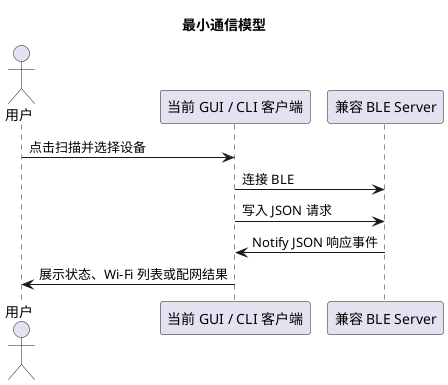
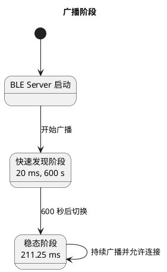
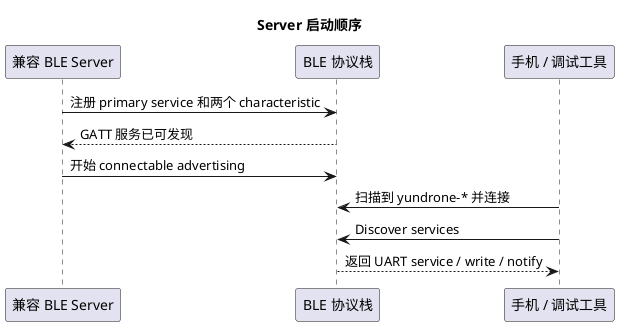
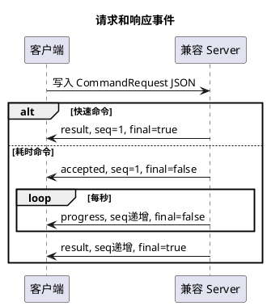
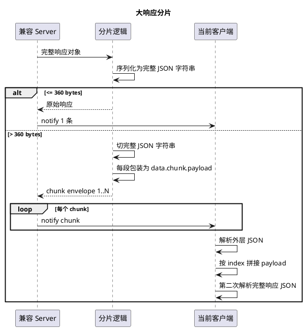

# 兼容 YunDrone 客户端的 BLE Server 实现指南

本文给准备实现另一套 BLE server 的同事使用。目标不是复刻 Rust/BlueZ 的内部代码，而是在任意设备上做出一个能被当前 `client` / `gui` 直接发现、连接、收发命令的兼容服务端。

读完本文后，你应能实现这些能力：

- 设备能被当前客户端扫描为候选设备。
- 设备能暴露同一套 BLE service 与 characteristic。
- 设备能接收 V2 JSON 请求并返回 V2 JSON 响应事件。
- 大响应能按当前分片格式拆包。
- 客户端现有心跳、系统信息、Wi-Fi 扫描、配网、Wi-Fi 记忆管理页面能正常工作。

## 1. 最小心智模型

当前客户端把 BLE 设备当成一个很简单的请求-响应网关。客户端扫描到一个名字以 `yundrone-` 开头的设备后，会连接它，然后向一个写入特征写 JSON 请求，再从一个通知特征接收 JSON 响应。



这里有三个必须兼容的面：

- 发现面：客户端如何在扫描结果里认出你。
- GATT 面：客户端连接后找哪些 service 和 characteristic。
- 协议面：客户端写入什么 JSON，你需要返回什么 JSON。

## 2. 发现面：设备命名和广播

客户端主要通过 BLE 广播里的 `Local Name` 找设备。当前默认前缀是：

```text
yundrone
```

设备名必须使用一个单一 BLE local name，不要再设计“短名 / 长名”两套名字。推荐格式是：

```text
<prefix>-<base36_6>
```

默认实例：

```text
yundrone-ytcwln
```

字段说明：

- `<prefix>` 是业务前缀，默认 `yundrone`。只使用小写 ASCII 字母、数字和 `-`。
- `<base36_6>` 是 6 个小写 base36 字符，即 `0-9a-z`。它应来自芯片唯一 ID、MAC 地址、序列号或设备 ID 的稳定哈希。
- 名字必须跨重启保持稳定，避免 iOS、微信小程序或调试工具把同一物理设备识别成多个缓存对象。
- Linux 参考 server 使用 `/var/lib/yundrone/ble-device-name` 作为权威命名文件（吴建豪注：这部分意味着需要在一个固定的位置存储命名文件，程序每次启动时应当检查此文件，如果此文件不存在或者格式不正确，则重新生成或者覆盖）；文件合法则复用，缺失或非法则重建并写回。

客户端当前候选判断规则是：

- `localName` 必须匹配 `<prefix>-<base36_6>`，例如 `yundrone-ytcwln`，才进入候选列表。
- 如果某些平台把名字显示成 `host [yundrone-ytcwln]`，客户端也能识别方括号里的稳定身份。
- 只有 service UUID 但没有目标前缀的设备不会进入候选列表。

## 3. 广播字段要求

广播里至少要表达两类信息：

- 设备身份：一个 `Complete Local Name`，值为 `yundrone-<base36_6>`。
- 服务类型：Nordic UART Service UUID，值为 `6e400001-b5a3-f393-e0a9-e50e24dcca9e`。

推荐的广播布局：

| 内容 | 建议位置 | 说明 |
| --- | --- | --- |
| Flags | primary advertising data | 使用普通可发现 BLE peripheral 标志 |
| Complete Local Name | primary advertising data 优先 | 当前客户端和小程序都优先看它 |
| Nordic UART Service UUID | advertising data 或 scan response | 用于 Bluefruit `Must UART Service` 和平台 service 过滤 |

如果 payload 空间不够，优先保证 `Complete Local Name` 可见，再把 128-bit Service UUID 放到 scan response。当前 Linux legacy HCI 后端就是 primary ADV 放名字，scan response 放 UART Service UUID。

不要广播第二个 local name。BLE 可以在不同来源显示多个“看起来像名字”的字段，但本项目只承诺一个业务身份：`Local Name = yundrone-...`。

## 4. 广播频率策略

当前项目采用“先非常容易被发现，再进入稳态”的双阶段广播策略。

| 阶段 | interval min | interval max | 持续时间 | 目的 |
| --- | --- | --- | --- | --- |
| 快速发现阶段 | `20 ms` | `20 ms` | `600 s` | 开机后 10 分钟内尽量让手机和小程序快速发现 |
| 稳态阶段 | `211.25 ms` | `211.25 ms` | 一直持续 | 保持可发现，同时降低广播占用 |

实现时请注意：

- 快速发现阶段从设备开机或 BLE server 启动时开始计时。
- 600 秒后切到稳态阶段即可，不需要客户端参与。
- 如果你的平台不支持精确 interval，也应尽量选择接近这两个值的档位。
- 不要把 interval 放到 1 秒以上。实际移动端扫描会明显变慢，用户会误以为设备不存在。
- 广播应保持 connectable 和 discoverable。



## 5. GATT 服务和特征

当前客户端按 Nordic UART 风格查找固定 UUID。你必须暴露下面三个 UUID。

| 类型 | UUID | 属性 | 用途 |
| --- | --- | --- | --- |
| Service | `6e400001-b5a3-f393-e0a9-e50e24dcca9e` | primary service | 命令服务 |
| Write Characteristic | `6e400002-b5a3-f393-e0a9-e50e24dcca9e` | write 或 write without response | 接收客户端 JSON 请求 |
| Notify Characteristic | `6e400003-b5a3-f393-e0a9-e50e24dcca9e` | notify | 返回 JSON 响应事件 |

实现时有一个很重要的顺序要求：先让 GATT 服务和特征真正可发现，再开始广播。

原因很朴素：手机或 Bluefruit Connect 看到广播后会立刻连接，并马上做服务发现。如果设备已经开始广播，但 GATT 服务还没有注册完成，调试工具可能卡在 `Discovering services`，用户会看到“连上了但一直找不到服务”。我们在 Linux ARM 开发板上实际遇到过这个问题；把启动顺序改为“先 `ble.gatt.ready`，再 `ble.advertising.ready`”后，Bluefruit 的服务发现恢复正常。

推荐启动顺序：



连接后的推荐顺序：

1. 客户端连接 peripheral。
2. 客户端发现 service。
3. 客户端找到 write characteristic。
4. 客户端找到 notify characteristic。
5. 客户端订阅 notify。
6. 客户端开始写入请求。

服务端实现要求：

- 注册 GATT 成功之后再开始广播。
- 当前协议不需要系统配对或 bonding。正常状态应为 connectable 但 non-pairable。
- 不要为了“看起来更纯 BLE”盲目强制 LE-only 或 static random address。我们在部分 combo Wi-Fi/Bluetooth 控制器上实测过：强制 `btmgmt bredr off` 或 `btmgmt static-addr` 会导致 iOS/macOS 连接后 ATT MTU exchange 无响应，Bluefruit 卡在 `Discovering services`。
- 收到 write 后按 UTF-8 JSON 解析。
- 所有响应都通过 notify characteristic 发出。
- 如果响应大于单帧预算，需要按本文后面的分片格式发出多条 notify。
- 不要依赖 BLE 连接建立本身代表业务握手成功。客户端会通过 GATT service/characteristic 和 `link.heartbeat` 验证可用性。

Linux / BlueZ 设备建议保持控制器默认 dual-mode，但关闭 pairable/bondable：

```text
current settings: powered connectable br/edr le secure-conn
Pairable: no
UUID: Nordic UART Service
```

业务层仍然只暴露 Nordic UART 风格 BLE GATT 服务。Classic profile 是否出现在 `bluetoothctl show` 属于 BlueZ adapter 层展示，不应通过破坏控制器工作模式来隐藏；用户可见身份应通过 advertising `Local Name`、Adapter `Alias` 和文档引导解决。

## 6. 协议版本和 JSON 基本规则

当前协议版本固定为：

```text
YundroneBT-V2.0.0
```

请求是一个 JSON 对象：

```json
{
  "id": "request-id",
  "cmd": "domain.action",
  "args": {},
  "v": "YundroneBT-V2.0.0"
}
```

字段规则：

| 字段 | 类型 | 必需 | 说明 |
| --- | --- | --- | --- |
| `id` | string | 是 | 客户端生成的请求 ID，响应必须原样带回 |
| `cmd` | string | 是 | 命令名 |
| `args` | object | 是 | 参数对象，没有参数就传 `{}` |
| `v` | string | 是 | 必须是 `YundroneBT-V2.0.0` |

响应也是 JSON 对象。V2 响应是“事件”，也就是一个请求可能收到多条响应。

```json
{
  "id": "request-id",
  "cmd": "wifi.scan",
  "phase": "result",
  "seq": 1,
  "final": true,
  "ok": true,
  "code": "OK",
  "text": "human readable summary",
  "data": {},
  "v": "YundroneBT-V2.0.0"
}
```

字段规则：

| 字段 | 类型 | 必需 | 说明 |
| --- | --- | --- | --- |
| `id` | string | 是 | 对应请求 ID |
| `cmd` | string | 建议必带 | 原命令名，便于日志和调试 |
| `phase` | string | 是 | `accepted`、`progress`、`result` |
| `seq` | number | 是 | 同一请求内从 1 开始递增 |
| `final` | boolean | 是 | 只有最后一条事件为 `true` |
| `ok` | boolean | 是 | 当前事件是否成功 |
| `code` | string | 是 | 机器可读结果码 |
| `text` | string | 是 | 人可读摘要 |
| `data` | object | 否 | 命令返回数据 |
| `v` | string | 是 | `YundroneBT-V2.0.0` |

快速命令只返回一个 `phase=result, final=true` 事件。耗时命令返回三类事件：

1. `accepted`：表示已经接收请求并开始处理。
2. `progress`：表示还在执行中，建议每秒发一次。
3. `result`：最终结果，必须 `final=true`。



## 7. 支持的命令

你至少要实现下列命令。若某些系统能力暂时无法真实实现，也要返回结构兼容的结果，避免客户端崩溃。

### 7.1 `link.heartbeat`

用途：应用层心跳，客户端用于判断连接是否还活着。

请求：

```json
{"id":"req-1","cmd":"link.heartbeat","args":{},"v":"YundroneBT-V2.0.0"}
```

响应：

```json
{
  "id": "req-1",
  "cmd": "link.heartbeat",
  "phase": "result",
  "seq": 1,
  "final": true,
  "ok": true,
  "code": "OK",
  "text": "alive",
  "data": {
    "alive": true
  },
  "v": "YundroneBT-V2.0.0"
}
```

注意：GUI 每 5 秒发一次心跳，连续失败 3 次会认为连接断开。

### 7.2 `system.status`

用途：返回设备诊断信息。它替代旧的 `status`、`sys.whoami`、`net.ifconfig`。

请求：

```json
{"id":"req-status","cmd":"system.status","args":{},"v":"YundroneBT-V2.0.0"}
```

响应数据：

```json
{
  "hostname": "device-name",
  "system": "Firmware or OS version",
  "user": "operator",
  "network": "LabWiFi",
  "ip": "192.0.2.23",
  "interfaces": [
    {
      "ifname": "wlan0",
      "kind": "wifi",
      "ipv4": "192.0.2.23"
    }
  ]
}
```

字段规则：

- `hostname`: 设备主机名或设备名。
- `system`: 固件版本、OS 版本或硬件平台信息。
- `user`: 操作用户。嵌入式设备没有多用户概念时可返回 `"device"`。
- `network`: 当前连接的网络名；没有就省略或返回 `null`。
- `ip`: 当前优先 IPv4；没有就省略或返回 `null`。
- `interfaces`: IPv4 网卡列表。`kind` 只能是 `wifi`、`ethernet`、`other`。

### 7.3 `system.capabilities`

用途：让调试器或客户端知道 server 支持哪些命令和能力。

请求：

```json
{"id":"req-cap","cmd":"system.capabilities","args":{},"v":"YundroneBT-V2.0.0"}
```

响应数据：

```json
{
  "protocol_version": "YundroneBT-V2.0.0",
  "commands": [
    "link.heartbeat",
    "system.status",
    "system.capabilities",
    "wifi.scan",
    "wifi.provision",
    "wifi.profiles.list",
    "wifi.profiles.delete"
  ],
  "features": [
    "response_events",
    "response_json_chunking",
    "wifi_profile_management"
  ],
  "payload_limit": 360
}
```

### 7.4 `wifi.scan`

用途：扫描周边 Wi-Fi。它是耗时命令，应该先回 `accepted`，执行中回 `progress`，最后回 `result`。

请求：

```json
{"id":"req-wifi-scan","cmd":"wifi.scan","args":{},"v":"YundroneBT-V2.0.0"}
```

可选参数：

```json
{"ifname":"wlan0"}
```

最终响应数据：

```json
{
  "ifname": null,
  "count": 2,
  "networks": [
    {
      "ssid": "LabWiFi",
      "channel": "6",
      "signal": 78
    },
    {
      "ssid": "DroneDebug",
      "channel": "11",
      "signal": 61
    }
  ]
}
```

字段规则：

- `ifname`: 请求指定的网卡名；没有指定可返回 `null`。
- `count`: `networks` 数量。
- `networks[].ssid`: Wi-Fi 名称。
- `networks[].channel`: 信道，字符串即可。
- `networks[].signal`: 信号强度。当前 GUI 按整数展示，建议使用 0 到 100 的质量值；如果你的平台只能提供 dBm，也要确保客户端展示语义可接受。

### 7.5 `wifi.provision`

用途：保存凭据并连接 Wi-Fi。它是耗时命令。

请求：

```json
{"id":"req-prov","cmd":"wifi.provision","args":{"ssid":"LabWiFi","pwd":"password"},"v":"YundroneBT-V2.0.0"}
```

开放网络可省略 `pwd`：

```json
{"ssid":"OpenWiFi"}
```

成功响应数据：

```json
{
  "status": "connected",
  "ssid": "LabWiFi",
  "ip": "192.0.2.23"
}
```

失败响应数据：

```json
{
  "status": "failed",
  "ssid": "LabWiFi"
}
```

推荐响应码：

- 成功：`PROVISION_SUCCESS`
- 密码错误、连接失败：`PROVISION_FAIL`
- 参数缺失：`BAD_REQUEST`
- 超时：`TIMEOUT`

### 7.6 `wifi.profiles.list`

用途：列出设备已经保存的 Wi-Fi 记忆。客户端会在配网页展示它们，并允许选择删除。

请求：

```json
{"id":"req-profile-list","cmd":"wifi.profiles.list","args":{},"v":"YundroneBT-V2.0.0"}
```

响应数据：

```json
{
  "profiles": [
    {
      "uuid": "11111111-2222-3333-4444-555555555555",
      "name": "LabWiFi",
      "ssid": "LabWiFi",
      "active": true,
      "device": "wlan0",
      "autoconnect": true
    },
    {
      "uuid": "aaaaaaaa-bbbb-cccc-dddd-eeeeeeeeeeee",
      "name": "OldWiFi",
      "ssid": "OldWiFi",
      "active": false,
      "autoconnect": false
    }
  ]
}
```

字段规则：

- `uuid`: 删除操作的唯一 key。不要让客户端按 SSID 删除。
- `name`: profile 名称。没有 profile 概念时可与 `ssid` 相同。
- `ssid`: Wi-Fi SSID。
- `active`: 当前是否正在使用。
- `device`: active 时建议返回网卡名；非 active 可省略。
- `autoconnect`: 是否自动连接。

### 7.7 `wifi.profiles.delete`

用途：按 UUID 批量删除已保存 Wi-Fi 记忆。它是耗时命令。

请求：

```json
{
  "id": "req-profile-delete",
  "cmd": "wifi.profiles.delete",
  "args": {
    "uuids": [
      "aaaaaaaa-bbbb-cccc-dddd-eeeeeeeeeeee"
    ],
    "force": false
  },
  "v": "YundroneBT-V2.0.0"
}
```

规则：

- `uuids` 必须是字符串数组。
- `force` 可省略，默认当作 `false`。
- 当 `active=true` 且 `force=false` 时，不要删除当前正在使用的 profile，应放入 `skipped`。
- GUI 默认不会发送 `force=true`。

最终响应数据：

```json
{
  "deleted": [
    {
      "uuid": "aaaaaaaa-bbbb-cccc-dddd-eeeeeeeeeeee",
      "name": "OldWiFi",
      "ssid": "OldWiFi"
    }
  ],
  "skipped": [
    {
      "uuid": "11111111-2222-3333-4444-555555555555",
      "name": "LabWiFi",
      "ssid": "LabWiFi",
      "reason": "active_profile"
    }
  ],
  "failed": []
}
```

推荐响应码：

- `OK`: 请求项全部删除成功。
- `PARTIAL_SUCCESS`: 有删除成功，也有跳过或失败。
- `PROTECTED_PROFILE`: 只命中了受保护 active profile，没有实际删除。
- `BAD_REQUEST`: `uuids` 缺失或类型错误。
- `INTERNAL_ERROR`: 底层删除失败。

## 8. 耗时命令的事件顺序

耗时命令包括：

- `wifi.scan`
- `wifi.provision`
- `wifi.profiles.delete`

推荐事件顺序如下：

```json
{
  "id": "req-wifi-scan",
  "cmd": "wifi.scan",
  "phase": "accepted",
  "seq": 1,
  "final": false,
  "ok": true,
  "code": "ACCEPTED",
  "text": "accepted",
  "v": "YundroneBT-V2.0.0"
}
```

```json
{
  "id": "req-wifi-scan",
  "cmd": "wifi.scan",
  "phase": "progress",
  "seq": 2,
  "final": false,
  "ok": true,
  "code": "IN_PROGRESS",
  "text": "please wait",
  "v": "YundroneBT-V2.0.0"
}
```

```json
{
  "id": "req-wifi-scan",
  "cmd": "wifi.scan",
  "phase": "result",
  "seq": 8,
  "final": true,
  "ok": true,
  "code": "OK",
  "text": "wifi scan complete",
  "data": {
    "ifname": null,
    "count": 0,
    "networks": []
  },
  "v": "YundroneBT-V2.0.0"
}
```

实现建议：

- `accepted` 必须尽快返回，让用户知道点击已生效。
- `progress` 不需要包含复杂百分比；当前客户端只需要知道任务仍在运行。
- `result` 才更新业务卡片。
- 同一时间建议只运行一个前台耗时命令。若已有耗时命令正在运行，第二个耗时命令可以返回 `BUSY`。
- `link.heartbeat` 不应被前台耗时任务阻塞。

## 9. 响应码一览

| code | ok | 场景 |
| --- | --- | --- |
| `OK` | true | 普通成功 |
| `ACCEPTED` | true | 耗时命令已接收 |
| `IN_PROGRESS` | true | 耗时命令进行中 |
| `PROVISION_SUCCESS` | true | 配网成功 |
| `PARTIAL_SUCCESS` | true 或 false | 批量删除部分成功、部分跳过或失败 |
| `PROTECTED_PROFILE` | true | 删除请求只命中受保护 active profile |
| `BAD_JSON` | false | JSON 解析失败 |
| `BAD_REQUEST` | false | 参数错误或协议版本不支持 |
| `UNKNOWN_COMMAND` | false | 命令不存在 |
| `BUSY` | false | 已有前台耗时任务 |
| `PROVISION_FAIL` | false | 配网失败 |
| `INTERNAL_ERROR` | false | 设备内部执行失败 |
| `TIMEOUT` | false | 设备内部执行超时 |

## 10. 大响应分片

当前客户端认为单个 BLE notify 里的已编码 JSON 响应帧最大安全预算是：

```text
360 bytes
```

如果一条完整响应 JSON 编码后不超过 360 bytes，可以直接 notify 原始响应。

如果超过 360 bytes，必须把“完整响应 JSON 字符串”切成多个片段。每个片段再包装成一个合法 `CommandResponse`，放在 `data.chunk` 里。

这里先用最直白的话讲清楚：**切片切的是完整响应 JSON，不是只切 `text`，也不是只切 `data.networks`。**

例如 `wifi.scan` 的 `text` 可能只有 `wifi scan complete`，但真正大的内容在 `data.networks`。如果只看 `text`，你会以为它很小；但 BLE notify 真正发送的是整个响应 JSON，所以必须先把完整响应序列化成 UTF-8 JSON 字节，再判断是否超过 360 bytes。

正确的思路是：

1. 先构造完整业务响应。
2. 把完整业务响应序列化成 JSON 字符串。
3. 计算这个 JSON 字符串的 UTF-8 字节长度。
4. 如果长度不超过 360 bytes，就直接 notify。
5. 如果长度超过 360 bytes，就把这个完整 JSON 字符串切成多段。
6. 每一段放进一个新的 `CommandResponse.data.chunk.payload`。
7. 客户端收齐所有段以后，先拼回完整 JSON 字符串，再把它解析成原始业务响应。

注意第 6 步：每个分片外面还会再包一层 JSON，所以不能简单地把 payload 固定切成 360 字节。外层 envelope 本身也占字节，最终发出去的整条 chunk JSON 必须小于等于 360 bytes。

分片 envelope 示例：

```json
{
  "id": "req-wifi-scan",
  "cmd": "wifi.scan",
  "phase": "result",
  "seq": 8,
  "final": true,
  "ok": true,
  "code": "OK",
  "text": "",
  "data": {
    "chunk": {
      "mode": "response_json",
      "index": 1,
      "total": 4,
      "payload": "{\"id\":\"req-wifi-scan\",..."
    }
  },
  "v": "YundroneBT-V2.0.0"
}
```

### 10.1 反斜杠到底是什么

上面示例里的 `payload` 看起来像这样：

```json
"payload": "{\"id\":\"req-wifi-scan\",..."
```

这里的反斜杠 `\` 不是 BLE 协议的一部分，也不是我们额外发明的转义规则。它只是标准 JSON 字符串转义。

原因是：`payload` 字段本身是一个 JSON 字符串，而这个字符串的内容又是一段“原始响应 JSON”。原始响应 JSON 里面有很多双引号，例如：

```json
{"id":"req-wifi-scan","cmd":"wifi.scan"}
```

当这段 JSON 被放进另一个 JSON 字符串字段时，里面的双引号必须写成 `\"`，否则外层 JSON 会坏掉。所以外层看到的是：

```json
{
  "payload": "{\"id\":\"req-wifi-scan\",\"cmd\":\"wifi.scan\"}"
}
```

实现时不要手写奇怪的反斜杠处理。正确做法是：

1. 服务端把完整响应 JSON 当成普通字符串。
2. 服务端构造 chunk envelope 对象，把某一段字符串放进 `data.chunk.payload`。
3. 服务端用标准 JSON serializer 编码整个 chunk envelope。
4. serializer 会自动把 `payload` 里面的 `"` 写成 `\"`。
5. 客户端收到 chunk envelope 后，先用标准 JSON parser 解析外层 JSON。
6. 解析完成后，客户端拿到的 `data.chunk.payload` 字符串里已经没有这些用于外层 JSON 的反斜杠。
7. 客户端把多个 payload 字符串按顺序拼接，再对拼出来的完整字符串做第二次 JSON parse。

换句话说：

- 空口上看到 `\"` 是正常现象。
- 代码里拿到的 payload 字符串应该是 `{"id":"...`，不是 `{\"id\":\"...`。
- 不要对 payload 再做一次“删除所有反斜杠”。
- 不要把 `\` 当成分片边界。
- 不要用正则解析 JSON。
- 用 JSON 库解析外层 envelope，再用 JSON 库解析重组后的内层完整响应。

一个最小例子：

原始完整响应是：

```json
{"id":"r1","cmd":"system.status","text":"ok","data":{"device_name":"yundrone-bw0uwj"}}
```

如果它需要分片，某个 chunk 的 `payload` 在服务端对象里只是普通字符串：

```text
{"id":"r1","cmd":"system.status",
```

但这个 chunk envelope 被 JSON 编码后，日志或调试器里会显示为：

```json
"payload": "{\"id\":\"r1\",\"cmd\":\"system.status\","
```

客户端 JSON parser 解析外层 envelope 后，拿到的 payload 值又会变回：

```text
{"id":"r1","cmd":"system.status",
```

所以看到反斜杠并不代表数据坏了；看不到反斜杠也不代表数据丢了。反斜杠只是 JSON 文本展示层为了表达“字符串里包含双引号”而加的。

分片规则：

- `mode` 必须是 `response_json`。
- `index` 从 `1` 开始。
- `total` 是总片数。
- `payload` 是原始完整响应 JSON 的一段字符串。
- 每个 chunk envelope 自身重新 JSON 编码后也必须 `<= 360 bytes`。
- 所有分片的 `id/cmd/phase/seq/final/ok/code/v` 应沿用原始响应事件。
- `text` 在分片 envelope 中为空字符串。
- 客户端按 `id` 收齐全部 `payload`，按 `index` 拼接，然后再解析成原始完整响应。
- `payload` 必须按 UTF-8 字符边界切，不要把一个多字节字符切坏。
- 如果你的实现只会输出 ASCII JSON，按字节切通常也能工作；但更稳的做法是按 UTF-8 安全边界切。
- 每个请求的分片会话用 `id` 区分。收到 `total` 个分片并成功重组后，要清理该 `id` 的缓存。
- 如果同一个 `id` 的同一个 `index` 重复到达，可以覆盖同位置内容；不要把重复分片追加两次。
- 如果 `index < 1`、`index > total` 或 `total == 0`，应视为协议错误。

最小伪代码：

```text
server_send_response(resp):
  json = JSON.stringify(resp)
  if utf8_len(json) <= 360:
    notify(json)
    return

  fragments = []
  remaining = json
  while remaining is not empty:
    fragment = largest_prefix_that_fits_in_chunk_envelope(remaining, 360)
    fragments.push(fragment)
    remaining = remaining after fragment

  total = fragments.length
  for i, fragment in fragments:
    chunk_resp = copy_metadata_from(resp)
    chunk_resp.text = ""
    chunk_resp.data = {
      "chunk": {
        "mode": "response_json",
        "index": i + 1,
        "total": total,
        "payload": fragment
      }
    }
    notify(JSON.stringify(chunk_resp))

client_on_notify(bytes):
  resp = JSON.parse(bytes)
  if resp.data.chunk does not exist:
    deliver_to_business(resp)
    return

  chunk = resp.data.chunk
  save chunk.payload by resp.id and chunk.index
  if not all chunks for resp.id are present:
    return

  full_json = concatenate payloads by index 1..total
  original_resp = JSON.parse(full_json)
  clear cache for resp.id
  deliver_to_business(original_resp)
```

常见错误：

- 错误：只切 `text`。正确：切完整响应 JSON。
- 错误：把 `data` 直接塞进某一片，不放进 `payload`。正确：每片都是 `data.chunk.payload`。
- 错误：每片 payload 裸长度都切 360 bytes。正确：整个 chunk envelope 编码后必须 `<= 360 bytes`。
- 错误：客户端收到第一片就尝试解析业务响应。正确：收齐全部 payload，拼回完整 JSON 后再解析。
- 错误：看到 `\"` 就手动删反斜杠。正确：交给 JSON parser；手动删会破坏合法字符串，例如 SSID 里真的包含反斜杠时会出错。
- 错误：把 chunk envelope 的 `data.chunk.payload` 当最终业务 `data`。正确：`data.chunk` 只是传输层中间包，业务层不应该看见它。



## 11. 错误处理

如果收到格式错误的请求，尽量返回一个 final 错误事件。若 JSON 完全无法解析、连 `id` 都取不到，可以只记录日志，不返回协议事件。

旧协议版本示例：

```json
{"id":"old-version","cmd":"link.heartbeat","args":{},"v":"YundroneBT-V1.0.0"}
```

建议返回：

```json
{
  "id": "old-version",
  "cmd": "link.heartbeat",
  "phase": "result",
  "seq": 1,
  "final": true,
  "ok": false,
  "code": "BAD_REQUEST",
  "text": "unsupported protocol version: YundroneBT-V1.0.0",
  "v": "YundroneBT-V2.0.0"
}
```

未知命令示例：

```json
{"id":"old-ping","cmd":"ping","args":{},"v":"YundroneBT-V2.0.0"}
```

建议返回：

```json
{
  "id": "old-ping",
  "cmd": "ping",
  "phase": "result",
  "seq": 1,
  "final": true,
  "ok": false,
  "code": "UNKNOWN_COMMAND",
  "text": "unknown command: ping",
  "v": "YundroneBT-V2.0.0"
}
```

## 12. 实现检查清单

发现和广播：

- Local Name 是唯一业务名字，格式为 `yundrone-<base36_6>`。
- 广播或 scan response 中声明 UART Service UUID。
- 广播 connectable、discoverable。
- 快速阶段约 20 ms，持续 600 秒。
- 稳态阶段约 211.25 ms。

GATT：

- Primary service UUID 是 `6e400001-b5a3-f393-e0a9-e50e24dcca9e`。
- Write characteristic UUID 是 `6e400002-b5a3-f393-e0a9-e50e24dcca9e`。
- Notify characteristic UUID 是 `6e400003-b5a3-f393-e0a9-e50e24dcca9e`。
- 必须先完成 GATT 注册，再开始广播，避免手机抢连后卡在服务发现。
- 客户端订阅 notify 后能收到响应。

协议：

- 只接受 `YundroneBT-V2.0.0`。
- 所有响应带回同一个 `id`。
- 快速命令返回单个 `result`。
- 耗时命令返回 `accepted/progress/result`。
- `final=true` 只出现在最终事件。
- 大响应按 `response_json` 分片。
- 单个 notify JSON 帧不超过 360 bytes。

业务：

- `link.heartbeat` 能稳定返回。
- `system.capabilities` 列出全部命令。
- `system.status` 返回 hostname/system/user/network/ip/interfaces。
- `wifi.scan` 返回 networks 数组。
- `wifi.provision` 返回 connected 或 failed。
- `wifi.profiles.list` 返回 profiles 数组。
- `wifi.profiles.delete` 按 UUID 删除，并保护 active profile。

## 13. 调试建议

第一轮联调建议按这个顺序：

1. 用 Bluefruit Connect 或 nRF Connect 确认能看到 `Local Name: yundrone-...`。
2. 开启 Bluefruit 的 `Must UART Service`，确认设备仍可见。
3. 连接后确认不会长期停在 `Discovering services`。
4. 确认三个 UUID 都存在。
5. 订阅 notify characteristic。
6. 写入 `link.heartbeat`，确认返回 `alive=true`。
7. 写入 `system.capabilities`，确认命令列表完整。
8. 写入 `wifi.scan`，确认先收到 `accepted`，再收到 `progress`，最后收到 `result`。
9. 制造一个超过 360 bytes 的 `wifi.scan` 结果，确认客户端能重组分片。
10. 写入 `wifi.profiles.list`，确认 GUI 能显示已保存 Wi-Fi。
11. 删除一个非 active profile，确认 GUI 能刷新列表。

最小测试请求：

```json
{"id":"debug-heartbeat-001","cmd":"link.heartbeat","args":{},"v":"YundroneBT-V2.0.0"}
```

如果这个请求不能返回，先不要调 Wi-Fi 功能。优先检查 notify 是否开启、write UUID 是否正确、JSON 是否按 UTF-8 写入。

## 14. 和当前客户端适配时最容易踩的坑

- 不要用系统蓝牙名当业务名。客户端看的是广播 `Local Name`。
- 不要恢复旧名字 `Yundrone_UAV-*` 或 `YD-*`。当前客户端默认不把它们当候选。
- 不要只实现连接后的 GATT service，却忘了在广播或 scan response 里声明 UART Service UUID。这样 Bluefruit 的 `Must UART Service` 或微信 service 过滤可能看不到设备。
- 不要在 GATT 服务注册完成前就开始广播。调试工具可能一看到广告就连接，随后卡在 `Discovering services`。
- 不要把大 JSON 直接塞进一个 notify。`wifi.scan` 和 profile 列表很容易超过 360 bytes。
- 不要让 `link.heartbeat` 被长任务阻塞。GUI 依赖它判断连接健康。
- 不要按 SSID 删除 Wi-Fi 记忆。必须按 `uuid` 删除，避免误删同名网络。
- 不要默认删除 active profile。除非请求明确 `force=true`，否则应返回 skipped。

## 15. 兼容目标总结

一个兼容 server 的核心承诺可以浓缩为：

```text
广播名: yundrone-<base36_6>
Service: 6e400001-b5a3-f393-e0a9-e50e24dcca9e
Write:   6e400002-b5a3-f393-e0a9-e50e24dcca9e
Notify:  6e400003-b5a3-f393-e0a9-e50e24dcca9e
协议:    YundroneBT-V2.0.0
单帧:    <= 360 bytes
长任务:  accepted -> progress -> result
```

只要这几条满足，当前 GUI / CLI 客户端就能把你的实现当成同一类 YunDrone BLE Gateway 来使用。
