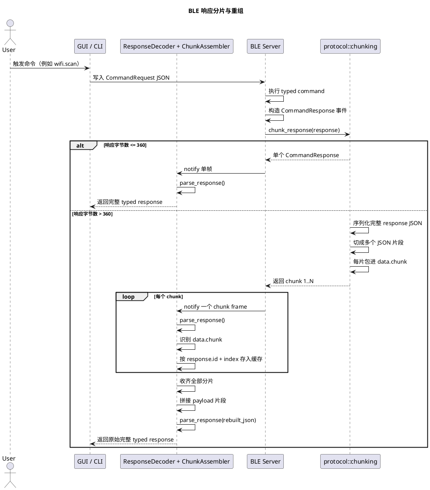

# BLE MTU 分片中间件说明

本文说明当前 BLE 网关里用于绕过单帧负载限制的响应分片中间件实现方式，以及它和底层 BLE MTU 的关系。

## 1. 当前实际大小上限

现在协议层真正使用的单帧上限是：

```rust
pub const MAX_BLE_PAYLOAD_BYTES: usize = 360;
```

来源： [crates/protocol/src/lib.rs](../crates/protocol/src/lib.rs)

这里必须明确区分两个概念：

- 这个 `360` 是我们网关协议层人为设定的 **单个已编码 JSON 响应帧的安全上限**。
- 它 **不是** 当前代码里某个运行时协商出来、并被显式暴露的 ATT MTU 值。
- 当前分片中间件只保证：每一个最终 `encode_response()` 之后发出去的 JSON 帧，长度都不超过 `360` 字节。

也就是说，今天的传输策略是：

- 把 `360 bytes` 视作当前 BLE 响应单帧预算。
- 如果一整个响应 JSON 能塞进去，就原样单帧发送。
- 如果塞不进去，就切成多个协议分片，再由客户端透明重组。

## 2. 为什么需要这层中间件

最初暴露出来的问题是：有些 typed 响应看起来 `text` 很短，但 `data` 很大，典型例子就是 `wifi.scan`。

这种响应会击穿“只按 text 切片”的旧思路：

- 业务响应从表面看很小，因为只看了 `text`
- 实际序列化后的完整 JSON 很大，因为真正的大头在 `data`
- 服务端把一个超大的 JSON 直接塞进单次 BLE notify
- 客户端收到的是被底层截断的 JSON，于是解析时报错，例如 `EOF while parsing a string`

现在的中间件修复方式是：

- 不再只切某个字段
- 改为对 **完整的 `CommandResponse` 序列化 JSON** 做切片

核心实现文件： [crates/protocol/src/chunking.rs](../crates/protocol/src/chunking.rs)

## 3. 当前分片逻辑

### 3.1 服务端切片规则

`chunk_response(resp)` 的行为是：

1. 先对完整 `CommandResponse` 执行 `encode_response(&resp)`。
2. 如果编码后的 JSON 长度 `<= 360`，直接返回单个原始响应。
3. 如果编码后的 JSON 长度 `> 360`，就把这个完整 JSON 字符串拆成多个片段。
4. 每个片段再包进一个 chunk envelope，放进 `response.data.chunk`。
5. 每个 chunk envelope 在重新编码后，仍必须保证 `<= 360` 字节。

关键函数：

- `chunk_response(...)`
- `chunk_serialized_response(...)`
- `next_payload_fragment(...)`
- `chunk_fits_limit(...)`

来源： [crates/protocol/src/chunking.rs](../crates/protocol/src/chunking.rs#L130)

### 3.2 chunk envelope 结构

每个传输分片本身仍然是一个合法的 `CommandResponse`，只是它的 `data` 里临时塞了中间件元数据：

```json
{
  "id": "same-request-id",
  "ok": true,
  "code": "OK",
  "text": "",
  "data": {
    "chunk": {
      "mode": "response_json",
      "index": 1,
      "total": 4,
      "payload": "{...原始完整响应 JSON 的一段...}"
    }
  },
  "cmd": "wifi.scan",
  "phase": "result",
  "seq": 8,
  "final": true,
  "v": "YundroneBT-V2.1.0"
}
```

这个结构有几个特点：

- `id` 保持原始 response id，不变。
- `cmd`、`phase`、`seq`、`final`、`code`、`ok`、`v` 也都沿用原响应事件。
- 分片传输阶段的 `text` 是空串。
- 原始业务数据并不是直接暴露给 GUI/CLI，而是先临时躲在 `data.chunk.payload` 里。

这样分片责任就被限制在协议传输层，不会污染 UI 层和业务层。

### 3.3 片段大小是怎么算的

这里不是简单拍脑袋按固定长度截字符串。

当前算法会：

- 取剩余还没发出去的完整响应 JSON 字符
- 用二分搜索找出“重新包成 chunk response 后仍能塞进 360 字节”的最大片段
- 发出这个最大片段
- 然后继续处理剩余内容

因此，真正被约束的是：

- **最终 chunk frame 编码后的总长度**

而不是：

- 原始 payload 子串本身的裸长度

## 4. 客户端如何重组

客户端 UI 代码本身不需要直接理解 chunk metadata。

当前流程是：

1. 收到一条 BLE notification。
2. `ResponseDecoder` 先把它解析成 `CommandResponse`。
3. `ChunkAssembler` 判断 `data.chunk` 是否存在。
4. 如果不是 chunk，直接返回完整响应。
5. 如果是 chunk，就按 `response.id` 建立或更新一个组装会话。
6. 等 `received == total` 时，把所有片段按顺序拼起来。
7. 对拼好的完整 JSON 再执行一次 `parse_response(...)`。
8. 最终返回原始完整的 `CommandResponse`。

相关实现：

- [crates/client/src/response.rs](../crates/client/src/response.rs)
- [crates/protocol/src/chunking.rs](../crates/protocol/src/chunking.rs#L6)

重组行为有几个关键点：

- 会话键是 `response.id`
- 每片按 `index` 放入对应位置
- 必须等所有分片齐了才会产出最终响应
- 重组成功后会立即清理该会话状态，避免后续串包

## 5. 旧兼容路径还在，但只是兜底

`ChunkAssembler` 里还保留了一条旧格式兼容路径：

- `parse_legacy_chunk_meta(...)`
- `add_legacy_chunk(...)`

这条路径只用于容忍旧版“只切 text”的 chunk envelope。

当前新服务端的正规路径应当始终是：

- `mode = "response_json"`

所以今天正确的主链路应该理解为：

- 服务端对完整响应做 full-response chunking
- 客户端对完整响应做 full-response reassembly
- 只有重组完成后，才进入 typed `decode_data()`

## 6. 这层中间件在整体链路中的位置

### 请求路径

- Client 目前还是把一个完整请求 JSON 直接写入 BLE。
- 当前分片中间件主要用于 **响应方向**，因为已知的大包问题集中在 typed response。

### 响应路径

- Server 执行 typed command。
- Server 生成一个 typed `CommandResponse` 事件；V2 下耗时命令可能先发送 `accepted/progress` 小事件，最终 `result` 大事件也走同一分片链路。
- `protocol::chunking::chunk_response(...)` 把它转换成一个或多个 BLE 安全帧。
- Server 逐帧 notify。
- Client 侧的 `ResponseDecoder + ChunkAssembler` 在业务/UI 看见之前，把它恢复成原始响应。

服务端接入点： [crates/server/src/command_events.rs](../crates/server/src/command_events.rs)

## 7. 可观测性

服务端当前会在日志里记录和分片相关的几个关键字段：

- `chunk_count`
- `chunk_mode`
- `chunk_sizes`
- `payload_limit`
- `response_bytes`
- `max_chunk_bytes`

这是判断某条命令是否真的跨过单帧上限、是否真的进入分片路径的第一观察点。

解释方式：

- `chunk_count=1`：完整响应本次没有超过 360 字节预算
- `chunk_count>1`：完整响应 JSON 被拆成了多次 BLE notify

## 8. PlantUML 时序图



## 9. 现有测试如何保护这条链路

协议层测试已经覆盖了几个关键场景：

- 不分片响应的 round-trip
- 大文本响应的 round-trip
- 大 typed data 响应的 round-trip
- `wifi.scan` 这种“text 很小、data 很大”的响应也必须进入分片
- 每个 chunk 最终编码长度都不能超过 `MAX_BLE_PAYLOAD_BYTES`

示例：

- [crates/protocol/src/tests.rs](../crates/protocol/src/tests.rs#L224)
- [crates/client/src/response.rs](../crates/client/src/response.rs#L41)

## 10. 维护时最重要的结论

- 当前网关的有效单帧预算是 `360 bytes`。
- 我们修复的是“完整响应 JSON”的传输问题，不是只修某个字段。
- GUI 和 CLI 不需要自己处理 chunk 业务逻辑。
- 将来任何返回大 `data` 的命令，都应该自动复用这条分片通道。
- 如果后面又出现截断问题，第一步先看服务端日志里的 `chunk_count`、`response_bytes` 和 `max_chunk_bytes`，不要先去怀疑 UI。
