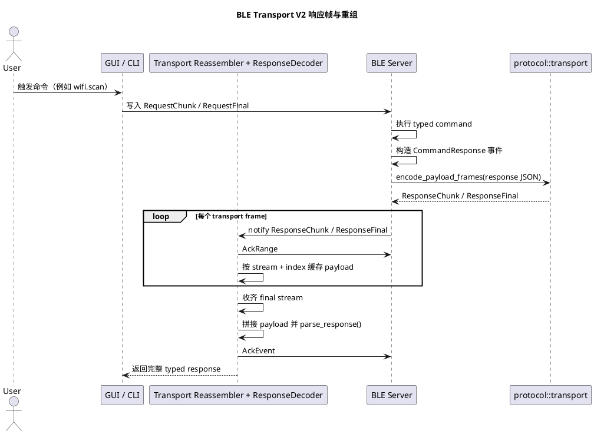

# BLE Transport V2 与 legacy MTU 分片说明

本文说明当前 BLE 网关的主传输路径，以及旧 JSON 分片中间件和底层 BLE MTU 的关系。

当前 GUI/CLI 主路径已经是 **BLE Transport V2 compact binary framing**：

- 每个 BLE write/notify 按保守 20 字节预算发送。
- 前 4 字节是 transport header：magic/version + frame kind、stream id、frame index。
- 后 16 字节是请求或响应 JSON 的 payload 片段。
- 请求方向使用 `RequestChunk` / `RequestFinal`。
- 响应方向使用 `ResponseChunk` / `ResponseFinal`。
- 耗时命令的周期性“正在进行”提示使用 header-only `Progress` 控制帧。
- 确认使用 `AckRange` / `AckEvent`，不再依赖 JSON `link.ack`。

本文后面提到的 `360 bytes` 和 `data.chunk` 是 legacy JSON chunking 路径，仍用于旧客户端兼容、通用 BLE 调试工具兜底和历史实现解释；正常 CLI/GUI 不再把它作为主传输方式。

## 1. 当前主路径：V2 紧凑传输帧

V2 transport 的关键常量在 [crates/protocol/src/transport.rs](../crates/protocol/src/transport.rs)：

```rust
pub const FRAME_HEADER_LEN: usize = 4;
pub const MAX_FRAME_PAYLOAD_LEN: usize = 16;
pub const MAX_LOGICAL_PAYLOAD_LEN: usize = 4080;
```

一条完整业务 JSON 会先被序列化成 UTF-8 bytes，再切成最多 255 个 transport payload fragment。每个 fragment 被包成一个 20 字节以内的二进制帧。

因此 verbose 日志里刷屏的 `[RX:packet]` 不是重复业务响应，而是同一个响应事件的多个 16 字节 payload frame。只有 `[RX:assembled]` 才是重组后的完整业务 JSON。

## 2. Legacy JSON 分片大小上限

legacy JSON 分片路径的单帧上限是：

```rust
pub const MAX_BLE_PAYLOAD_BYTES: usize = 360;
```

来源： [crates/protocol/src/lib.rs](../crates/protocol/src/lib.rs)

这里必须明确区分两个概念：

- 这个 `360` 是我们网关协议层人为设定的 **单个已编码 JSON 响应帧的安全上限**。
- 它 **不是** 当前代码里某个运行时协商出来、并被显式暴露的 ATT MTU 值。
- 当前分片中间件只保证：每一个最终 `encode_response()` 之后发出去的 JSON 帧，长度都不超过 `360` 字节。

也就是说，legacy JSON 分片策略是：

- 把 `360 bytes` 视作当前 BLE 响应单帧预算。
- 如果一整个响应 JSON 能塞进去，就原样单帧发送。
- 如果塞不进去，就切成多个协议分片，再由客户端透明重组。

## 3. 为什么仍然保留这层中间件

最初暴露出来的问题是：有些 typed 响应看起来 `text` 很短，但 `data` 很大，典型例子就是 `wifi.scan`。

这种响应会击穿“只按 text 切片”的旧思路：

- 业务响应从表面看很小，因为只看了 `text`
- 实际序列化后的完整 JSON 很大，因为真正的大头在 `data`
- 服务端把一个超大的 JSON 直接塞进单次 BLE notify
- 客户端收到的是被底层截断的 JSON，于是解析时报错，例如 `EOF while parsing a string`

legacy 中间件当时的修复方式是：

- 不再只切某个字段
- 改为对 **完整的 `CommandResponse` 序列化 JSON** 做切片

核心实现文件： [crates/protocol/src/chunking.rs](../crates/protocol/src/chunking.rs)

## 4. Legacy JSON 分片逻辑

### 4.1 服务端切片规则

`chunk_response(resp)` 的行为是：

1. 先对完整 `CommandResponse` 执行 `encode_response(&resp)`。
2. 如果编码后的 JSON 长度 `<= 360`，直接返回单个原始响应。
3. 如果编码后的 JSON 长度 `> 360`，就把这个完整 JSON 字符串拆成多个片段。
4. 每个片段再包进一个 chunk envelope，放进 `response.data.chunk`。
5. 每个 chunk envelope 在重新编码后，仍必须保证 `<= 360` 字节。

关键函数：

- `chunk_response(...)`
- `chunk_serialized_response(...)`
- `next_payload_fragment(...)`
- `chunk_fits_limit(...)`

来源： [crates/protocol/src/chunking.rs](../crates/protocol/src/chunking.rs#L130)

### 4.2 chunk envelope 结构

每个传输分片本身仍然是一个合法的 `CommandResponse`，只是它的 `data` 里临时塞了中间件元数据：

```json
{
  "id": "same-request-id",
  "ok": true,
  "code": "OK",
  "text": "",
  "data": {
    "chunk": {
      "mode": "response_json",
      "index": 1,
      "total": 4,
      "payload": "{...原始完整响应 JSON 的一段...}"
    }
  },
  "cmd": "wifi.scan",
  "phase": "result",
  "seq": 8,
  "final": true,
  "v": "YundroneBT-V2.1.0"
}
```

这个结构有几个特点：

- `id` 保持原始 response id，不变。
- `cmd`、`phase`、`seq`、`final`、`code`、`ok`、`v` 也都沿用原响应事件。
- 分片传输阶段的 `text` 是空串。
- 原始业务数据并不是直接暴露给 GUI/CLI，而是先临时躲在 `data.chunk.payload` 里。

这样分片责任就被限制在协议传输层，不会污染 UI 层和业务层。

### 4.3 片段大小是怎么算的

这里不是简单拍脑袋按固定长度截字符串。

当前算法会：

- 取剩余还没发出去的完整响应 JSON 字符
- 用二分搜索找出“重新包成 chunk response 后仍能塞进 360 字节”的最大片段
- 发出这个最大片段
- 然后继续处理剩余内容

因此，真正被约束的是：

- **最终 chunk frame 编码后的总长度**

而不是：

- 原始 payload 子串本身的裸长度

## 5. 客户端如何重组 legacy chunk

客户端 UI 代码本身不需要直接理解 chunk metadata。

当前流程是：

1. 收到一条 BLE notification。
2. `ResponseDecoder` 先把它解析成 `CommandResponse`。
3. `ChunkAssembler` 判断 `data.chunk` 是否存在。
4. 如果不是 chunk，直接返回完整响应。
5. 如果是 chunk，就按 `response.id` 建立或更新一个组装会话。
6. 等 `received == total` 时，把所有片段按顺序拼起来。
7. 对拼好的完整 JSON 再执行一次 `parse_response(...)`。
8. 最终返回原始完整的 `CommandResponse`。

相关实现：

- [crates/client/src/response.rs](../crates/client/src/response.rs)
- [crates/protocol/src/chunking.rs](../crates/protocol/src/chunking.rs#L6)

重组行为有几个关键点：

- 会话键是 `response.id`
- 每片按 `index` 放入对应位置
- 必须等所有分片齐了才会产出最终响应
- 重组成功后会立即清理该会话状态，避免后续串包

## 6. 旧兼容路径还在，但只是兜底

`ChunkAssembler` 里还保留了一条旧格式兼容路径：

- `parse_legacy_chunk_meta(...)`
- `add_legacy_chunk(...)`

这条路径只用于容忍旧版“只切 text”的 chunk envelope。

如果进入 legacy JSON chunking，新服务端的正规格式应当始终是：

- `mode = "response_json"`

所以 legacy 路径应理解为：

- 服务端对完整响应做 full-response chunking
- 客户端对完整响应做 full-response reassembly
- 只有重组完成后，才进入 typed `decode_data()`

## 7. 这层中间件在整体链路中的位置

### 请求路径

- 当前 CLI/GUI 会把请求 JSON 交给 V2 transport，再拆成 `RequestChunk` / `RequestFinal` 写入 BLE。
- legacy JSON 分片主要用于旧响应方向；如果用通用 BLE 工具手写小 JSON，请求仍可走旧的直写兼容路径。

### 响应路径

- Server 执行 typed command。
- Server 生成 typed `CommandResponse` 事件；V2 下耗时命令会先发送完整 JSON `accepted`，周期性发送 header-only `Progress` 控制帧，最终 `result` 仍走完整 JSON 响应链路。
- 主路径下 server 用 V2 transport 把 `accepted` 和 `result` 拆成 `ResponseChunk` / `ResponseFinal`；`Progress` 不携带 JSON payload，也不进入 ACK 窗口。
- legacy fallback 下，`protocol::chunking::chunk_response(...)` 把它转换成一个或多个 JSON chunk envelope。
- Client 侧会先做 V2 transport reassembly；如果收到 legacy JSON chunk，再由 `ResponseDecoder + ChunkAssembler` 在业务/UI 看见之前恢复成原始响应。

服务端接入点： [crates/server/src/command_events.rs](../crates/server/src/command_events.rs)

## 8. 可观测性

服务端当前会在日志里记录和分片相关的几个关键字段：

- `chunk_count`
- `chunk_mode`
- `chunk_sizes`
- `payload_limit`
- `response_bytes`
- `max_chunk_bytes`

这是判断某条命令是否真的跨过单帧上限、是否真的进入分片路径的第一观察点。

legacy JSON chunk 解释方式：

- `chunk_count=1`：完整响应本次没有超过 360 字节预算
- `chunk_count>1`：完整响应 JSON 被拆成了多次 BLE notify

V2 transport verbose 解释方式：

- `[TX:packet]` / `[RX:packet]`：一个 20 字节以内的二进制 transport frame。
- `stream`：transport stream id；请求和每个响应事件分开计数。
- `index`：当前 stream 内的 frame 序号，从 1 开始。
- `final=true`：该 stream 的最后一个 payload frame。
- `Progress`：header-only 控制帧，表示长任务仍在进行，不携带 JSON payload。
- `AckRange`：确认某个 stream 已连续收到到哪个 index，用于推进窗口。
- `AckEvent`：确认某个响应事件已经完整交付到业务层。

## 9. PlantUML 时序图



## 10. 现有测试如何保护这条链路

协议层和服务端测试已经覆盖了几个关键场景：

- V2 transport payload frame encode/decode 与 reassembly
- transport ACK 窗口推进、重试和重复 final 防御
- 同一请求的 `accepted/result` 使用不同 response stream，周期性 progress 使用 header-only control frame
- 不分片响应的 round-trip
- 大文本响应的 round-trip
- 大 typed data 响应的 round-trip
- `wifi.scan` 这种“text 很小、data 很大”的响应也必须进入分片
- 每个 chunk 最终编码长度都不能超过 `MAX_BLE_PAYLOAD_BYTES`

示例：

- [crates/protocol/src/tests.rs](../crates/protocol/src/tests.rs#L224)
- [crates/client/src/response.rs](../crates/client/src/response.rs#L41)

## 11. 维护时最重要的结论

- 当前网关主路径的 BLE transport frame 预算是 `20 bytes`，其中 header `4 bytes`、payload `16 bytes`。
- `360 bytes` 是 legacy JSON chunking 的兼容预算，不是主路径 MTU。
- 我们修复的是“完整请求/响应 JSON”的传输问题，不是只修某个字段。
- GUI 和 CLI 不需要自己处理 chunk 业务逻辑。
- 将来任何返回大 `data` 的命令，都应该自动复用 V2 transport。
- 如果后面又出现截断问题，第一步先看 verbose 里的 `[RX:packet]`、`stream/index/final`、`[RX:assembled]` 和服务端 transport/QoS 日志，不要先去怀疑 UI。
